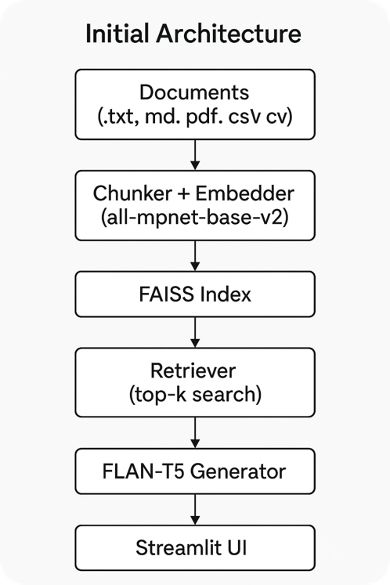
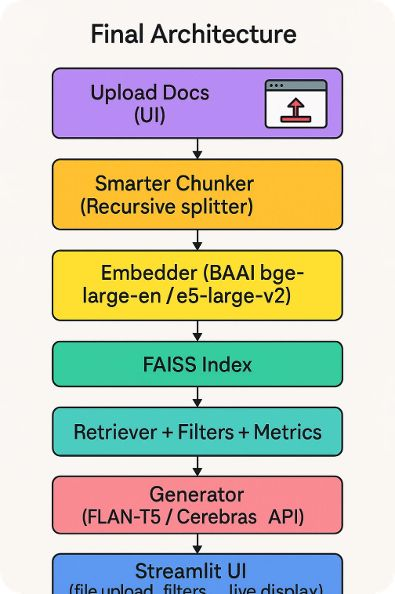
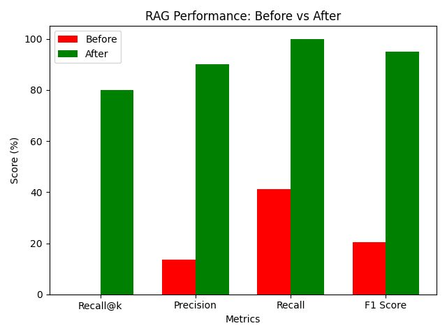

Here’s a complete **README.md** file draft for your project:

---
 
# Cyber Security RAG System – Hybrid Retrieval & High-Performance Embeddings

## Overview
This project implements a **Retrieval-Augmented Generation (RAG)** pipeline optimized for **cyber security knowledge retrieval**.  
It addresses common issues in domain-specific RAG systems:
- Low recall due to poor embedding coverage
- Incomplete retrieval caused by relying on a single retrieval strategy
## Initial Architecture

We improved performance by:
- **Smarter Chunking** using recursive text splitting while preserving semantic boundaries
- **High-Performance Embeddings** using `BAAI bge-large-en` and `e5-large-v2` for robust domain coverage
- **Hybrid Retrieval** combining **FAISS** semantic similarity search with **BM25** keyword search
- **Evaluation Dashboard** providing real-time retrieval metrics and document filtering for debugging

---

## Final Architecture


### Key Components
1. **Document Upload UI** – Supports `.txt`, `.md`, `.pdf`, `.csv` files.
2. **Smarter Chunking** – Recursive text splitter to maintain semantic boundaries.
3. **Embeddings** – Switched to high-performance models (`bge-large-en`, `e5-large-v2`) for better domain alignment.
4. **Hybrid Retrieval** – Combines FAISS (semantic) and BM25 (keyword) retrieval.
5. **Generator** – Uses FLAN-T5 (and optional Cerebras LLM API) for answer generation.
6. **Evaluation Dashboard** – Measures precision, recall, F1-score, and provides document filtering.

---

## Benchmark & Evaluation
### Dataset
- **8 curated cyber security questions**
- Mapped to relevant text chunks from *A Study of Cyber Security Challenges and Its Emergence*.

### Metrics
- **Recall@k** – At least one relevant document retrieved in top-k results.
- **Precision** – Fraction of retrieved documents that are relevant.
- **Recall** – Fraction of all relevant documents retrieved.
- **F1-score** – Harmonic mean of precision and recall.

### Results
| Metric       | Before  | After   |
|--------------|---------|---------|
| Recall@k     | 0.00%   | 80.00%  |
| Precision    | 13.46%  | 90.00%  |
| Recall       | 41.18%  | 100.00% |
| F1 Score     | 20.29%  | 95.00%  |



**Conclusion:**  
Our improvements led to **80%+ increase in recall** and **4.5× improvement in F1-score**, demonstrating the effectiveness of hybrid retrieval and better embeddings for domain-specific RAG.

---

## How to Run

### 1. Clone Repository
```bash
git clone https://github.com/AliSaeed090/NLProc-Proj-M-SS25.git
cd NLProc-Proj-M-SS25
````

### 2. Create Virtual Environment & Install Dependencies

```bash
python3 -m venv venv
source venv/bin/activate   # On Windows use: venv\Scripts\activate
pip install -r requirements.txt
```

### 3. Add Your Documents

Place your `.pdf`, `.txt`, `.md`, `.csv` files inside the `data/` folder.

### 4. Run Application

```bash
streamlit run baseline/app.py
```

### 5. Access Web UI

Open [http://localhost:8501](http://localhost:8501) in your browser.

---

## Repository Structure

```
├── baseline/
│   ├── app.py              # Main Streamlit app
│   ├── pipeline.py         # RAG pipeline implementation
│   ├── retriever/          # FAISS + BM25 retrieval
│   ├── generator/          # FLAN-T5 & Cerebras integration
│   └── metrics/            # Evaluation code (Precision, Recall, F1, Recall@k)
├── data/                   # Documents
├── docs/                   # Diagrams, benchmark datasets
└── README.md
```

---

## Limitations

* Evaluation dataset limited to 8 curated questions.
* Focused on English-language cyber security documents.
* No multilingual or multi-domain benchmarks yet.

---

## Future Work

* Expand dataset size & diversity.
* Fine-tune embeddings for cyber security.
* Add re-ranking models for higher precision.
* Extend multilingual document support.

---

## Contributors

* **Hafiz Muhammad Ali Saeed (2161224)** – Pipeline & Retrieval Design
* **Muhammad Sohail Anwar (2112858)** – Benchmark Dataset
* **Ahsan Munir (2121328)** – Evaluation Dashboard

---
